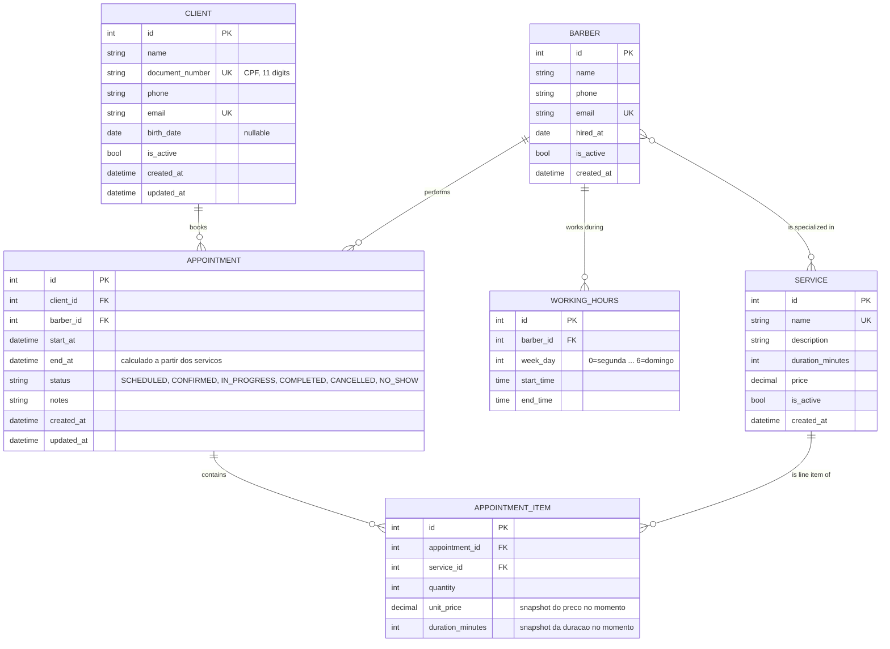
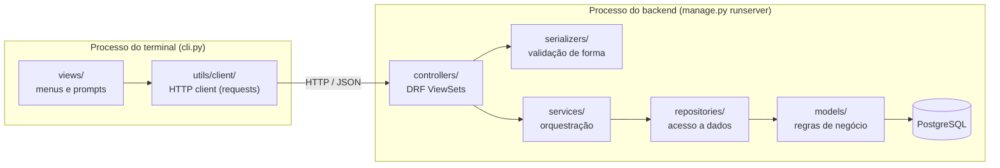

# Sistema de Gestão de Barbearia

## O problema

Na prática, a gestão de uma barbearia pequena ou média ainda depende de
caderno, grupo de WhatsApp ou agenda de papel na recepção. Isso não é só
"falta de tecnologia" — é **falta de organização estruturada**, e ela se
manifesta em problemas bem concretos do dia a dia:

- **Falta de organização geral** — não existe um lugar único onde
  clientes, barbeiros, serviços e horários vivem juntos e se relacionam
  entre si. Cada informação mora num lugar diferente: um caderno, uma
  conversa de WhatsApp, ou só na cabeça de quem trabalha na recepção
  naquele dia.
- **Conflito de horários** — como a agenda de cada barbeiro normalmente
  não é cruzada automaticamente com os agendamentos já feitos, é comum
  dois clientes serem marcados no mesmo horário com o mesmo profissional
  — e só um dos dois descobrir isso na hora, na porta da barbearia.
- **Lentidão para mapear o que está agendado** — responder "o que temos
  hoje às 15h?", "quantos cortes esse barbeiro fez esse mês?" ou "esse
  cliente já veio antes?" significa folhear um caderno ou rolar uma
  conversa de WhatsApp inteira. Não existe uma visão consolidada e rápida
  de consulta.
- **Preço/duração inconsistentes com o tempo** — se o preço de um corte
  muda, ninguém sabe mais quanto um agendamento antigo custou de fato,
  porque não existe um registro histórico daquele valor no momento da
  compra.
- **Zero rastreabilidade** — não há histórico confiável de quem atendeu
  quem, quando e por quanto, o que inviabiliza qualquer análise depois
  (faturamento por barbeiro, serviço mais vendido, taxa de não
  comparecimento etc.).

Este projeto (acadêmico, mas construído com práticas de mercado) ataca
essas dores criando o "lugar único" que falta: uma API que centraliza
clientes, barbeiros, serviços e agendamentos, que **nunca deixa** um
agendamento conflitante ser salvo, que guarda um **snapshot** do
preço/duração de cada serviço no momento da compra, e que persiste tudo em
um banco relacional de verdade — em vez de listas em memória que somem
quando o processo termina.

## Como o projeto resolve isso

| Dor | Como é resolvida | Onde no código |
|---|---|---|
| Falta de organização geral | Um único sistema centraliza clientes, barbeiros, serviços e agendamentos, relacionados entre si por chaves estrangeiras — não mais informações soltas em lugares diferentes | `models/` (todas as entidades) |
| Choque de horário | Regra de negócio que checa sobreposição de agenda antes de salvar | `models/appointment.py` → `Appointment.schedule()` |
| Agendar fora do expediente do barbeiro | Cada barbeiro tem um expediente por dia da semana, validado no momento do agendamento | `models/working_hours.py` → `WorkingHours.covers()` |
| Lentidão para mapear o que está agendado | Listagens com filtro por status/cliente/barbeiro e busca, expostas tanto pela API quanto pela CLI | `controllers/appointment_controller.py` + `views/appointment_view.py` |
| Preço/duração perdidos com o tempo | Cada item de agendamento guarda uma cópia (snapshot) do preço/duração do serviço | `models/appointment_item.py` → `AppointmentItem.build_for()` |
| Dados se perdem ao fechar o programa | Persistência real em PostgreSQL, não listas em memória | `docker-compose.yml` + `config/settings.py` |
| Ninguém mais lembra o que o sistema faz | Documentação Swagger/OpenAPI gerada automaticamente a partir do código | `config/urls.py` → `/api/docs/` |

## Stack técnica e por que cada peça foi escolhida

Nenhuma tecnologia aqui foi escolhida "porque é popular". Cada uma resolve
um problema específico do escopo acima:

| Tecnologia | Por que foi escolhida |
|---|---|
| **Django** | Framework maduro com ORM, migrations e admin prontos — evita reescrever camada de persistência na mão, o que tiraria o foco do que realmente importa aqui: a modelagem de domínio. |
| **Django REST Framework (DRF)** | Camada HTTP sobre o Django com serializers, viewsets e paginação prontos, exatamente o que uma API de agendamento precisa sem reinventar validação de requisição/resposta. |
| **PostgreSQL** | Banco relacional com suporte sólido a transações e constraints — essencial porque "não deixar dois agendamentos conflitantes serem salvos ao mesmo tempo" é, no fundo, um problema de concorrência que um banco relacional resolve bem com transações atômicas (`transaction.atomic` em `repositories/appointment_repository.py`). |
| **Docker + Docker Compose** | Empacota o Postgres e a API junto, para que todo mundo do grupo rode a *mesma versão* do banco sem precisar instalar PostgreSQL manualmente na máquina (fonte comum de "na minha máquina funciona"). |
| **drf-spectacular** | Gera a documentação OpenAPI/Swagger direto do código (serializers e viewsets), então a documentação nunca fica desatualizada em relação à API de verdade. |
| **django-filter** | Permite filtrar listagens (`?is_active=true`, `?status=SCHEDULED`) sem escrever query manual em cada endpoint. |
| **python-decouple** | Lê configuração sensível (senha do banco, secret key) de variáveis de ambiente em vez de deixar hardcoded no código — requisito básico de segurança mesmo em projeto acadêmico. |
| **requests** | Biblioteca HTTP usada pela CLI para falar com a API. Preferida a chamar `curl` via `subprocess` porque dá tratamento de erro/timeout nativo em Python, sem parsear stdout de outro processo. |

A escolha de **separar a API (backend Django) de um cliente de terminal
(CLI)** que fala HTTP com ela, em vez de um único script monolítico, existe
para simular como sistemas reais são construídos: o backend não sabe (nem
deveria saber) que existe um terminal do outro lado — poderia ser um app
mobile, um site, ou outro serviço. Veja `docs/CODE_STYLE.md` para os
detalhes de como as camadas (`models` → `repositories` → `services` →
`controllers`) se conectam.

## Diagrama de entidade-relacionamento



## Diagrama de arquitetura (camadas)



A CLI e o backend são **dois processos separados** falando HTTP entre si —
por isso rodam em terminais diferentes (veja o guia de instalação abaixo).

## Estrutura de pastas

```
barbershop/
├── manage.py / cli.py     # entrypoints do backend e da CLI
├── config/                # settings do Django + settings da CLI
├── models/                # entidades de domínio (1 arquivo por entidade) + regras de negócio
├── repositories/          # acesso a dados (ORM), sem regra de negócio
├── services/               # orquestração de casos de uso
├── controllers/             # DRF ViewSets (a camada HTTP)
├── serializers/               # validação de forma dos dados HTTP
├── exceptions/                 # exceções de domínio (backend) e de API (CLI)
├── views/                       # a "View" do terminal: menus, prompts, feedback
├── utils/                         # formatters, validators, e utils/client (infra HTTP)
└── static/                         # arquivos estáticos do Django
```

Veja `docs/CODE_STYLE.md` para o motivo de cada camada existir e o que pode
(ou não pode) ficar em cada uma.

## Dependências do projeto

Todas declaradas em `requirements.txt` (backend e CLI compartilham o mesmo
arquivo):

| Pacote | Versão mínima | Usado por |
|---|---|---|
| `Django` | 5.0 | Backend (ORM, migrations, admin) |
| `djangorestframework` | 3.15 | Backend (API HTTP) |
| `psycopg2-binary` | 2.9 | Backend (driver PostgreSQL) |
| `drf-spectacular` | 0.27 | Backend (documentação Swagger/OpenAPI) |
| `python-decouple` | 3.8 | Backend (variáveis de ambiente) |
| `django-filter` | 24.2 | Backend (filtros de listagem) |
| `requests` | 2.31 | CLI (cliente HTTP) |

Além disso, o banco de dados (PostgreSQL) roda dentro de um container
Docker — **não precisa instalar PostgreSQL na máquina**.

## Guia de instalação e execução

### Passo 0: clonar o repositório (Git)

Todo o código do projeto está no GitHub. Se você **nunca usou Git**, seguem
os passos — é só isso que você vai precisar saber para começar.

**1. Instale o Git**, se ainda não tiver:

- **Windows:** baixe em https://git-scm.com/download/win e instale com as
  opções padrão (pode ir clicando "Next" em tudo).
- **macOS:** abra o terminal e rode `git --version` — se não estiver
  instalado, o próprio macOS vai oferecer para instalar (via Xcode Command
  Line Tools). Ou instale via Homebrew: `brew install git`.
- **Linux (Ubuntu/Debian):** `sudo apt install git`

Confira se deu certo:
```bash
git --version
```

**2. Clone o repositório** — isso baixa uma cópia completa do projeto
(com todo o histórico) para o seu computador:

```bash
git clone https://github.com/miqu3iasg/barbershop.git
cd barbershop
```

Pronto, a partir daqui todos os comandos deste guia (`./setup.sh`,
`docker compose up`, `python cli.py`) são rodados de dentro dessa pasta
`barbershop/`.

Se você já tem uma conta no GitHub e vai **contribuir com código** (não só
rodar o projeto), veja a seção
[Fluxo de trabalho com Git](#fluxo-de-trabalho-com-git-para-quem-está-começando)
mais abaixo antes de começar a mexer em qualquer arquivo.

### Pré-requisito: Docker

O backend + banco de dados rodam via Docker Compose. Se você **nunca usou
Docker**, não se preocupe — é só um programa que roda os dois containers
(API e banco) sem precisar instalar nada manualmente no seu sistema
operacional. Instale:

- **Windows / macOS:** baixe e instale o **Docker Desktop**:
  https://www.docker.com/products/docker-desktop/
  Depois de instalado, abra o Docker Desktop uma vez e espere o ícone
  ficar verde (ele precisa estar rodando em segundo plano).
- **Linux (Ubuntu/Debian):**
  ```bash
  curl -fsSL https://get.docker.com | sh
  sudo usermod -aG docker $USER
  # depois disso, feche e abra o terminal de novo (ou faça logout/login)
  ```
- Para conferir se deu certo, rode no terminal:
  ```bash
  docker --version
  docker compose version
  ```
  Se os dois comandos responderem com um número de versão, está tudo certo.

Você também vai precisar de **Python 3.10 ou superior** instalado para
rodar a CLI (o backend roda dentro do Docker, então não precisa de Python
instalado na máquina para ele — só para a CLI).

### Passo a passo

O jeito mais rápido é rodar o script de setup, que faz essas checagens por
você:

```bash
./setup.sh
```

Se preferir fazer manualmente, ou se o `setup.sh` não rodar no seu sistema:

```bash
# 1. Copie o arquivo de variáveis de ambiente
cp .env.example .env

# 2. Suba o banco de dados + API
docker compose up --build -d

# 3. Confirme que a API está no ar
curl http://localhost:8000/api/docs/
```

- Documentação Swagger: **http://localhost:8000/api/docs/**
- Redoc: http://localhost:8000/api/redoc/
- Schema OpenAPI cru: http://localhost:8000/api/schema/

As migrations já vêm versionadas em `models/migrations/` e são aplicadas
automaticamente quando o container da API sobe (veja `entrypoint.sh`).

### Rodando a CLI

Em **outro terminal** (a API precisa continuar rodando no primeiro):

```bash
python3 -m venv .venv
source .venv/bin/activate        # no Windows: .venv\Scripts\activate
pip install -r requirements.txt
python cli.py
```

Por padrão a CLI aponta para `http://localhost:8000/api/v1`. Para apontar
para outro endereço, defina `BARBERSHOP_API_URL` antes de rodar.

### Roteiro rápido para testar

1. Cadastre um serviço (ex: "Corte", 30 min, R$ 45).
2. Cadastre um barbeiro e defina o expediente dele (menu Barbeiros →
   opção 3).
3. Cadastre um cliente.
4. Marque um agendamento — a CLI guia em 4 passos e mostra um resumo antes
   de confirmar.
5. Tente marcar outro agendamento no mesmo horário para o mesmo barbeiro,
   ou fora do expediente — a API vai recusar com uma mensagem de erro
   vinda direto da regra de negócio.
6. Ligue o "modo dev" (opção 5 do menu principal) para ver a requisição e
   a resposta HTTP cruas de cada ação.

### Fluxo de trabalho com Git (para quem está começando)

Esta seção é para quem vai **alterar o código** e mandar essas mudanças
para o repositório — não é necessária só para rodar o projeto. Se você
nunca usou Git em grupo, siga esta ordem toda vez que for trabalhar:

**1. Antes de começar a mexer em qualquer coisa, atualize sua cópia local:**

```bash
git checkout main
git pull origin main
```

Isso garante que você está partindo do código mais recente que o resto do
grupo já mandou, evitando trabalhar em cima de uma versão desatualizada.

**2. Crie uma branch nova para a sua tarefa** — nunca trabalhe direto na
`main`. Uma branch é basicamente uma "cópia paralela" do código onde você
pode mexer sem afetar ninguém até estar pronto:

```bash
git checkout -b tipo/nome-curto-da-tarefa
```

Use um prefixo que descreva o tipo de mudança, por exemplo:
- `feature/desativar-cliente` (nova funcionalidade)
- `fix/conflito-agendamento` (correção de bug)
- `docs/atualiza-readme` (documentação)

**3. Vá salvando seu progresso em commits pequenos**, um por mudança que
faça sentido isolada (não espere terminar a tarefa inteira para commitar
pela primeira vez):

```bash
git status                      # mostra o que você alterou
git add caminho/do/arquivo.py   # ou "git add ." para adicionar tudo
git commit -m "Adiciona endpoint de desativação de cliente"
```

Escreva a mensagem do commit no imperativo e descrevendo *o quê*, não
*como* (`"Corrige validação de CPF"`, não `"mudei um if"`).

**4. Envie sua branch para o GitHub:**

```bash
git push origin tipo/nome-curto-da-tarefa
```

Na primeira vez que der `push` numa branch nova, o Git vai te devolver um
link — pode clicar nele, ou ir direto no GitHub, para abrir um
**Pull Request** (PR). É a página onde o resto do grupo revisa sua
mudança antes dela entrar na `main`.

**5. Depois que o PR for aprovado e mesclado (merged) no GitHub**, volte
para a `main` local e atualize de novo, e pode apagar a branch que já
cumpriu seu papel:

```bash
git checkout main
git pull origin main
git branch -d tipo/nome-curto-da-tarefa
```

#### Comandos do dia a dia (resumo)

| Comando | Para que serve |
|---|---|
| `git status` | Ver o que você mudou desde o último commit |
| `git pull origin main` | Trazer as mudanças mais recentes da `main` |
| `git checkout -b nome-da-branch` | Criar e já entrar numa branch nova |
| `git checkout nome-da-branch` | Trocar para uma branch que já existe |
| `git add .` | Marcar todos os arquivos alterados para o próximo commit |
| `git commit -m "mensagem"` | Salvar as mudanças marcadas, com uma mensagem |
| `git push origin nome-da-branch` | Enviar sua branch para o GitHub |
| `git log --oneline` | Ver o histórico de commits, resumido |

#### Se der conflito

Se o Git avisar `CONFLICT` ao fazer `pull` ou `merge`, é porque duas
pessoas mexeram na mesma linha de um arquivo. O Git vai marcar o trecho
conflitante direto no arquivo, assim:

```
<<<<<<< HEAD
código que já estava na main
=======
seu código novo
>>>>>>> sua-branch
```

Edite o arquivo manualmente, decidindo o que deve ficar (às vezes é os
dois, às vezes só um), apague as marcações (`<<<<<<<`, `=======`,
`>>>>>>>`), depois:

```bash
git add caminho/do/arquivo-que-tinha-conflito.py
git commit
```

Se não tiver certeza de como resolver, é melhor perguntar no grupo do que
resolver errado — um conflito mal resolvido pode apagar código de outra
pessoa sem querer. Se travar, registre em `docs/FEEDBACK.md`.

## Outros documentos do projeto

- [`docs/CODE_STYLE.md`](docs/CODE_STYLE.md) — padrão de código que todo
  mundo do grupo deve seguir, com exemplos do que fazer e não fazer.
- [`docs/TODO.md`](docs/TODO.md) — lista do que ainda falta implementar.
- [`docs/FEEDBACK.md`](docs/FEEDBACK.md) — onde registrar dúvidas,
  problemas encontrados e sugestões.
